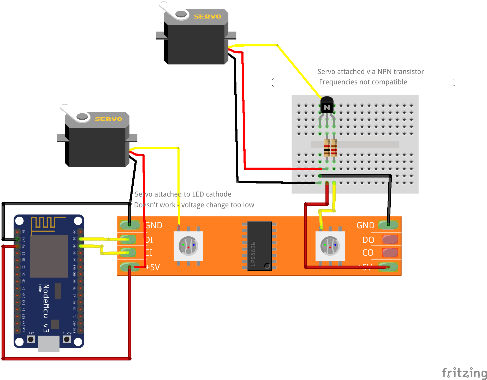

These were used in getting Micropython linked with a WS2801 light strip, and then for the attempt in driving servo motors from WS2801 LED strips.

See the youtube video for a full explaination: https://www.youtube.com/watch?v=U06c4os9Yuk&feature=youtu.be

The diagram shows an LPD8806, but the WS2801 and 8806 appear to be equivalent parts.

The file <servo_sweep.py> uses SPI to instruct the WS2801 lights to sweep up from 0 to 255, and then back down.

I also used the library <../python_libs/direct_servo.py> to test the motor directly connected to the NodeMCU.
